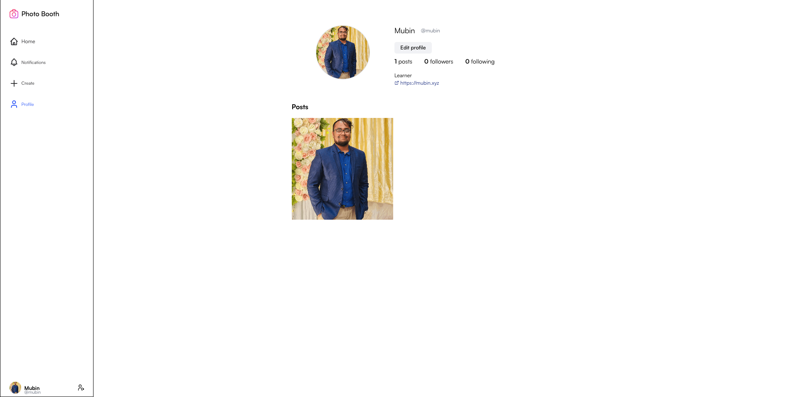
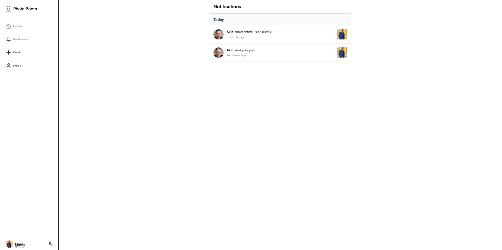

# 📸 Photo Booth - React Social Media App


A modern, Instagram-inspired social media application built with React. Users can share photos, interact with posts through likes and comments, manage profiles, and receive notifications. The app features a responsive design, infinite scrolling, and a seamless user experience.

---

## 📁 Project Structure

```
Photo Booth/
├── src/
│   ├── components/         # Reusable UI components
│   │   ├── Post.jsx       # Individual post component
│   │   ├── LikesModal.jsx # Modal showing who liked a post
│   │   ├── SideNavigation.jsx # Main navigation sidebar
│   │   ├── ClickableAvatar.jsx # Reusable avatar component
│   │   ├── ClickableUsername.jsx # Reusable username component
│   │   ├── LoginPopup.jsx # Authentication popup modal
│   │   ├── LoadingSpinner.jsx # Loading state component
│   │   ├── SuccessDialog.jsx # Success message dialog
│   │   ├── ErrorDialog.jsx # Error message dialog
│   │   └── FieldError.jsx # Form field error display
│   ├── pages/             # Application pages
│   │   ├── Home.jsx       # Main feed with infinite scroll
│   │   ├── Login.jsx      # User authentication
│   │   ├── Register.jsx   # User registration
│   │   ├── Profile.jsx    # User profile page
│   │   ├── EditProfile.jsx # Profile editing interface
│   │   ├── CreatePost.jsx # Post creation with image upload
│   │   ├── PostDetails.jsx # Detailed post view with comments
│   │   └── Notifications.jsx # User notifications center
│   ├── contexts/          # React context providers
│   │   └── AuthContext.jsx # Authentication state management
│   ├── utils/             # Utility functions
│   │   └── api.js         # API integration and utilities
│   ├── assets/            # Static assets and images
│   ├── App.jsx            # Main application component
│   └── main.jsx           # Application entry point
├── public/                # Public assets
├── screenshots/           # Application screenshots
└── README.md              # Project documentation
```

---

## 📝 Summary

Photo Booth is a React-based social media application that allows users to share photos, interact with content, and connect with others. Built with modern web technologies, it provides a seamless experience for photo sharing, social interactions, and profile management. The app includes features like infinite scrolling, notifications, image uploads, and responsive design.

---

## 📸 Screenshots / Demo






---

## 🚀 Core Features

### ✅ **Authentication & User Management**

- User registration and login with JWT tokens
- Access and refresh token system
- Profile management with avatar uploads
- Edit profile with bio, website, and personal info

### ✅ **Post Management**

- Create posts with image uploads and captions
- View posts in an infinite-scrolling feed
- Post details page with full interactions
- Image upload with validation and preview

### ✅ **Social Interactions**

- Like and unlike posts with real-time updates
- Add, edit, and delete comments
- View who liked a post (Likes Modal)
- Follow/unfollow users (poke system)

### ✅ **User Experience**

- Responsive design for mobile and desktop
- Side navigation with active state indicators
- Loading states and error handling
- Success/error dialogs for user feedback
- Infinite scroll for seamless browsing

### ✅ **Notifications**

- Real-time notifications for likes and comments
- Grouped by time (Today, Yesterday, This Week, Older)
- Click to navigate to relevant posts
- Comment text display in notifications

### ✅ **Profile System**

- User profiles with post grids
- Clickable avatars and usernames
- Profile statistics (posts, followers, following)
- "More from this user" section on post details

---

## 🚀 Advanced Features

### ✅ **Custom Components**

- Reusable `ClickableAvatar` and `ClickableUsername` components
- `LikesModal` for viewing post likes
- `LoginPopup` for unauthenticated interactions
- Form validation with `FieldError` component

### ✅ **State Management**

- React Context for authentication state
- Local state management for UI interactions
- Optimistic updates for better UX

### ✅ **API Integration**

- Axios for HTTP requests with interceptors
- Automatic token refresh handling
- Error handling and retry mechanisms
- Image URL utilities for backend integration

### ✅ **UI/UX Enhancements**

- Modern design with Tailwind CSS
- Smooth animations and transitions
- Hover effects and interactive elements
- Loading spinners and skeleton states

---

## ⚙️ Installation

### Prerequisites

- Node.js (v16 or higher)
- npm or pnpm

### Setup

1. **Clone the repository:**

   ```bash
   git clone https://github.com/mubinakib5/photo-booth.git
   cd photo-booth
   ```

2. **Install dependencies:**

   ```bash
   npm install
   ```

3. **Start development server:**

   ```bash
   npm run dev
   ```

4. **Build for production:**
   ```bash
   npm run build
   ```

The app will be available at `http://localhost:5173`.

---

## 📖 Usage Guide

### **Getting Started**

1. **Register/Login**: Create an account or sign in to access the app
2. **Complete Profile**: Add your bio, website, and upload an avatar
3. **Create Posts**: Upload images with captions to share with others
4. **Interact**: Like and comment on posts from other users

### **Navigation**

- **Home**: View the main feed with infinite scroll
- **Create**: Upload new photos with captions
- **Notifications**: Check your likes and comments
- **Profile**: View and edit your profile

### **Post Interactions**

- **Like**: Click the heart icon to like/unlike posts
- **Comment**: Add comments on posts (requires authentication)
- **View Details**: Click on posts to see full details and comments
- **See Likes**: Click on likes count to see who liked the post

### **Profile Management**

- **Edit Profile**: Update your bio, website, and personal information
- **Upload Avatar**: Change your profile picture
- **View Posts**: See all your shared posts in a grid layout

---

## 🛠️ Technology Stack

### **Frontend**

- **React 19** - Modern React with hooks and functional components
- **Vite** - Fast build tool and development server
- **React Router DOM** - Client-side routing
- **Tailwind CSS** - Utility-first CSS framework
- **Axios** - HTTP client for API requests
- **Lucide React** - Beautiful icon library
- **Date-fns** - Date manipulation utilities

### **Development Tools**

- **ESLint** - Code linting
- **PostCSS** - CSS processing
- **Autoprefixer** - CSS vendor prefixing

---

## 🔧 API Integration

This React application integrates with a Node.js backend API. The API endpoints include:

### **Authentication**

- `POST /auth/register` - User registration
- `POST /auth/login` - User login
- `POST /auth/refresh` - Refresh access token
- `POST /auth/logout` - User logout

### **Posts**

- `GET /posts` - Get all posts with pagination
- `POST /posts` - Create new post
- `GET /posts/:id` - Get specific post
- `POST /posts/:id/like` - Toggle post like
- `POST /posts/:id/comments` - Add comment

### **Users**

- `GET /users/profile` - Get current user profile
- `PUT /users/profile` - Update user profile
- `GET /users/:id` - Get user by ID

### **Notifications**

- `GET /notifications` - Get user notifications

---

## 🤝 Contribution Guide

We welcome contributions! Please follow these steps:

1. **Fork the repository**
2. **Create a feature branch:**
   ```bash
   git checkout -b feature/amazing-feature
   ```
3. **Make your changes and commit:**
   ```bash
   git commit -m 'Add amazing feature'
   ```
4. **Push to your branch:**
   ```bash
   git push origin feature/amazing-feature
   ```
5. **Open a Pull Request**

### **Development Guidelines**

- Follow the existing code style
- Add proper error handling
- Include loading states for better UX
- Test your changes thoroughly
- Update documentation if needed

---

## 🐛 Known Issues & Limitations

- **Image Upload**: Limited to 5MB file size
- **Comments**: Maximum 1000 characters per comment
- **Captions**: Maximum 2200 characters per post
- **Notifications**: Only supports like and comment notifications
- **Real-time**: No WebSocket implementation for real-time updates

---

## 🔮 Future Enhancements

- [ ] Real-time notifications with WebSockets
- [ ] Direct messaging between users
- [ ] Story feature (24-hour posts)
- [ ] Image filters and editing tools
- [ ] Search functionality
- [ ] Hashtag support
- [ ] Dark mode theme
- [ ] Mobile app (React Native)

---

## 📄 License

This project is licensed under the MIT License - see the [LICENSE](LICENSE) file for details.

---

## 🙌 Credits & References

- **Design Inspiration**: Instagram and modern social media platforms
- **Icons**: [Lucide React](https://lucide.dev/)
- **Styling**: [Tailwind CSS](https://tailwindcss.com/)
- **Date Handling**: [Date-fns](https://date-fns.org/)
- **HTTP Client**: [Axios](https://axios-http.com/)
- **Build Tool**: [Vite](https://vitejs.dev/)

---

## 📞 Support

If you encounter any issues or have questions:

1. Check the [Issues](https://github.com/mubinakib5/photo-booth/issues) page
2. Create a new issue with detailed information
3. Contact the development team

---

✅ _This project demonstrates modern React development practices with a focus on user experience, performance, and maintainable code architecture._
